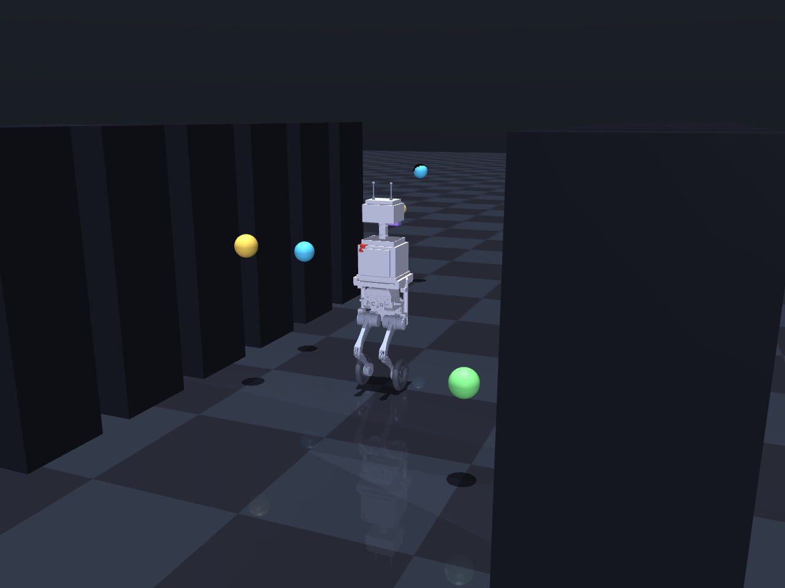
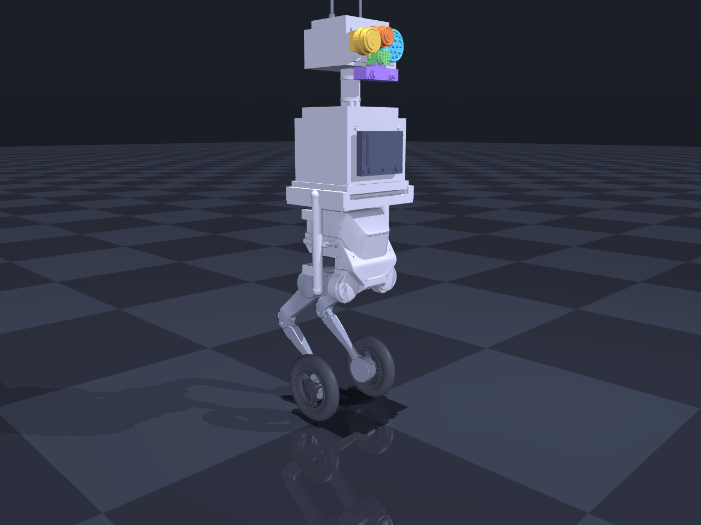

# BraveBot Sim

A 3D model and simulation library for **BraveBot** — the wheel-legged autonomous
inspection robot from [vigiles / bravebot-website](https://github.com/justinsuo/bravebot-website).
BraveBot is built on a modified **LimX Dynamics TRON 1** (WF_TRON1A) base and
carries a four-sensor inspection payload (acoustic · thermal · gas · visual)
with on-edge AI.

This repo turns the marketing-site concept into a runnable robot: a complete
robot description (MJCF + URDF), procedurally generated component meshes, and a
MuJoCo-based Python library to drive it, patrol a facility, and simulate sensor
coverage and anomaly detection.



---

## What's in the BraveBot

The model is assembled from two sources:

| Part of the robot | Source | Geometry |
|-------------------|--------|----------|
| Base, ab/ad, hip, knee, wheel (×2 legs) | **Real LimX TRON 1 meshes** (Apache-2.0) | `description/meshes/tron1/*.stl` |
| Payload deck, rugged torso, mast, sensor head, edge-AI core, hot-swap battery, displays, rails, antennas, e-stop, and the 4 sensors | **Original BraveBot geometry**, generated from primitives | `description/meshes/bravebot/*.stl` |

Every component, its mount frame, and its engineering metadata live in one place:
[`bravebot_sim/registry.py`](bravebot_sim/registry.py). A full parts list is in
[`docs/BILL_OF_MATERIALS.md`](docs/BILL_OF_MATERIALS.md) and
[`description/config/components.json`](description/config/components.json).

**Four-sensor inspection stack:** phased acoustic imaging array (ultrasonic to
100 kHz), radiometric thermal camera, VOC/CO/H₂ gas + optional OGI/TDLAS, and an
HD visual-AI camera with gauge OCR — plus a LiDAR/depth navigation cluster.



---

## Quick start

```bash
cd ~/bravebot-sim
python3 -m venv .venv && source .venv/bin/activate
pip install -r requirements.txt

python scripts/build_model.py        # generate meshes + MJCF + URDF
python scripts/view.py               # open the interactive viewer
```

### Interactive viewer

```bash
python scripts/view.py               # kinematic robot in the data-center scene
python scripts/view.py --physics     # REAL physics: balances on its wheels
python scripts/view.py --bare        # robot only, empty floor
```

> macOS note: the live viewer needs `mjpython scripts/view.py` (MuJoCo requires
> its own interpreter for the GUI). Headless scripts use plain `python`.

By default it runs an autonomous balancing patrol — just watch and orbit with
the mouse. The **arrow keys** take manual control:

| Key | Action |
|-----|--------|
| `↑` / `↓` | drive forward / back |
| `←` / `→` | turn left / right |
| `Enter` | resume autonomous patrol (and stop) |

Anomalies are scanned and printed continuously as the robot sees them. (Robot
control uses the arrow keys because the MuJoCo viewer binds every *letter* key
to a visualization toggle — `W`=wireframe, `S`=shadow, and so on.)

### Headless patrol demo (no window)

```bash
python scripts/patrol_demo.py        # drive the route, detect anomalies, render frames
```

```
[t=  0.2s]  detected via acoustic array
   ALERT · Rack 4B coolant micro-leak
     finding:    ultrasonic jet at a liquid-cooling connector
     risk:       moderate  (confidence 70%)
     action:     isolate line, inspect connector/switchgear, dispatch technician
...
Anomalies detected: 5/5
```

---

## Library API

```python
from bravebot_sim import BraveBot, PatrolController, diagnose, scene_path, facility

bot = BraveBot(scene_path())
ctrl = PatrolController(bot, facility.WAYPOINTS)

for _ in range(1500):
    ctrl.update()                      # nav toward next waypoint
    bot.step(0.02)                     # advance the unicycle model + pose legs/wheels
    alert = diagnose(bot.scan(facility.ANOMALIES))   # edge-AI fusion stub
    if alert and alert.confidence > 0.45:
        print(alert.render())

pos, look = bot.sensor_frame("thermal")  # world pose of any sensor
bot.set_stance("low")                    # wheel-legged variable geometry
```

There are **two simulation modes**:

- **Kinematic** (`BraveBot`, default): the base follows a unicycle (v, ω) model
  and the wheels/legs are posed for display. Deterministic, never tips — the
  right abstraction for inspection-coverage and sensor simulation.
- **Real physics** (`PhysicsBraveBot`): full MuJoCo rigid-body dynamics —
  gravity, contacts and actuator torques are all real. The robot is a Segway-class
  wheeled inverted pendulum (unstable in pitch, ~34 kg, CoM 0.69 m above the
  axle) and **actively balances on its two wheels** while driving.

## Real physics & balance control

```python
from bravebot_sim import PhysicsBraveBot, physics_scene_path

bot = PhysicsBraveBot(physics_scene_path())   # loads bravebot_physics.xml
bot.drive(0.7, 0.0)                            # 0.7 m/s forward
for _ in range(500):
    bot.step(0.02)                             # mj_step at 500 Hz + balance loop
print(bot.state().pitch, bot.fell)             # it stays upright
```

The two wheel **torque motors** do all the balancing, driving and steering; the
legs are held at the stance by stiff **position servos**. The controller
([`bravebot_sim/balance.py`](bravebot_sim/balance.py)) is a cascaded
state-feedback law on `pitch / pitch-rate / forward-velocity / yaw-rate`, read
from MuJoCo IMU/gyro/velocimeter sensors:

```
pitch_ref = clip(k_pv·(v_cmd − v), ±lean_max)        # lean to accelerate
τ_bal     = k_p·(pitch − pitch_ref) + k_d·pitch_rate
τ_turn    = k_yaw·(omega_cmd − yaw_rate)
τ_L = τ_bal − τ_turn ;  τ_R = τ_bal + τ_turn         # differential steering
```

Gains are **auto-tuned** against a headless eval harness:

```bash
python scripts/eval_balance.py --eval         # score the current gains
python scripts/eval_balance.py --tune         # search gains -> bravebot_sim/gains.json
python scripts/eval_balance.py --regression   # assert it stays upright (guards the sign)
python scripts/render_physics_video.py        # balance -> drive -> shove-recovery MP4
```

Tuned result: balances with **pitch RMS ~2°**, **station-keeps** (a velocity
integral cancels the CoM-ahead-of-axle creep), drives, and recovers from a 120 N
external shove.

**Turning is physically limited.** The robot has no roll actuation (single wheel
axle, legs fixed), so a *sustained* turn slowly winds up an uncontrolled roll
mode that diverges after ~130° — exactly how a real high-CoM wheeled biped rolls
over. The controller handles this with a **turn budget**: each turn burst is
capped (~34°) and followed by a brief straight "cooldown" so roll settles, and
the budget depletes faster at speed (centripetal `v·ω`). Net effect: balancing,
station-keeping, straight driving, and waypoint-style brief turns are robust;
continuous in-place spinning stutters but stays upright; a sustained *tight arc
at speed* is intentionally throttled. (Full rigid-body **gait/RL** for the real
TRON 1 — including active roll control — is a separate problem; here the legs
stay at a fixed stance.)

The control approach was designed and adversarially reviewed via multi-agent
workflows; the confirmed review findings (station-keeping, turn/roll limits,
NaN-safety) are fixed in the controller.

---

## Layout

```
bravebot_sim/         the library
  registry.py         every component, mount frame, sensor + spec (source of truth)
  meshgen.py          procedural STL generation for BraveBot parts (trimesh)
  sim.py              BraveBot (kinematic): drive, stance, sensor frames, scan
  balance.py          BalanceController + Gains for the real-physics model
  physics.py          PhysicsBraveBot: mj_step dynamics + balance loop
  gains.json          auto-tuned balance gains
  facility.py         data-center scene + anomalies + patrol waypoints
  patrol.py           waypoint controller + edge-AI diagnosis stub
description/
  meshes/tron1/       real LimX TRON 1 link meshes (Apache-2.0, see NOTICE)
  meshes/bravebot/    generated BraveBot component meshes
  mjcf/               bravebot.xml (kinematic) + bravebot_physics.xml (dynamics) + scenes
  urdf/               bravebot.urdf for ROS 2 / Gazebo / RViz
  config/             components.json manifest
scripts/              build_model · view · patrol_demo · eval_balance ·
                      render_hero · render_patrol_video · render_physics_video · export_manifest
renders/              hero stills + patrol & physics videos
```

## Regenerating everything

```bash
python scripts/build_model.py      # meshes + kinematic & physics MJCF + URDF
python scripts/export_manifest.py  # components.json + bill of materials
python scripts/render_hero.py      # hero stills (offscreen)
python scripts/eval_balance.py --regression   # verify the physics model still balances
```

---

## How this fits a real robotics stack

The simulation mirrors BraveBot's control hierarchy and is designed to drop into
a ROS 2 / TRON 1 workflow:

- **URDF** (`description/urdf/bravebot.urdf`) loads in RViz / Gazebo and can be
  repackaged as a `*_description` ROS 2 package (swap the relative mesh paths for
  `package://` URIs).
- **MJCF** runs the interactive MuJoCo sim locally on Apple Silicon — the same
  engine used for TRON 1 RL work — with no GPU required.
- The `PatrolController` → `BraveBot.drive()` boundary is the same
  *strategy → navigation → locomotion* split a real deployment uses: a
  high-level planner sets goals, the robot handles motion.

See [`docs/BILL_OF_MATERIALS.md`](docs/BILL_OF_MATERIALS.md) for the full parts
and sensor tables.

## Licensing

This project is Apache-2.0 (see `LICENSE`). The LimX TRON 1 link meshes in
`description/meshes/tron1/` are © LimX Dynamics, redistributed unmodified under
Apache-2.0 — see [`NOTICE`](NOTICE). All BraveBot modification geometry is
original work.
