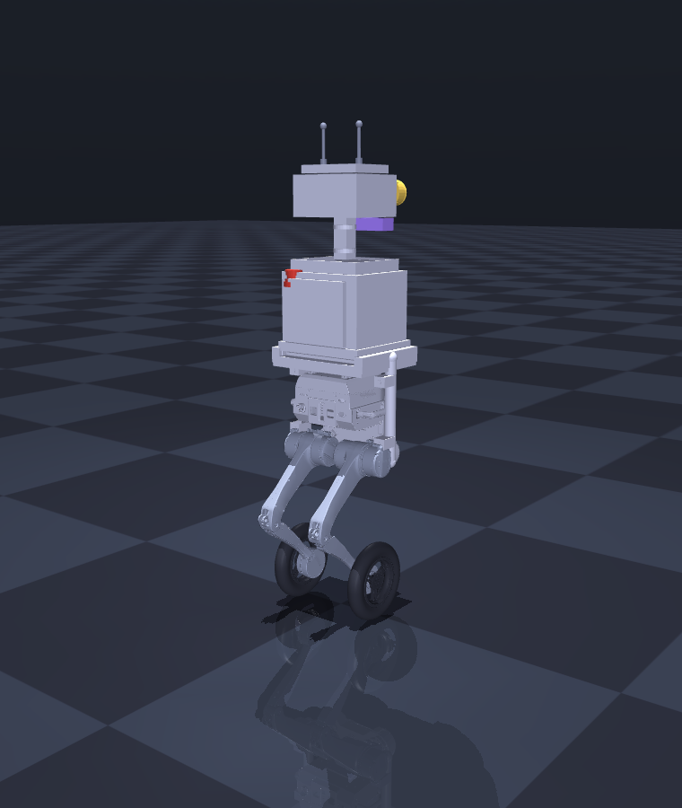

# BraveBot — Interactive Part Explorer

A presentable, browser-based 3D viewer that loads **every part of the robot**
(9 real LimX TRON 1 links + 18 BraveBot components = 27 parts) at their exact
assembled poses, and lets you **explode** the robot apart to inspect each piece.



## Run it

```bash
./scripts/view_parts.sh         # serves on :8000 and opens the explorer
# or manually, from the repo root:
python3 -m http.server 8000 --bind 127.0.0.1   # then open http://127.0.0.1:8000/web/
```
(Serve from the **repo root** so the mesh paths `../description/meshes/...` resolve.
Three.js loads from a CDN, so the page needs internet the first time.)

## What you can do

- **Drag** to orbit, **scroll** to zoom.
- **Explode slider / button** — slides the robot from fully assembled to a clean
  exploded view (each part moves radially out from the robot's center).
- **Click any part** (in the 3D view or the grouped Parts panel) to select it —
  the rest dim out and an info card shows the part's name, group, description, and
  (for sensors) modality / range / field-of-view.
- **Color by group** — recolor parts by subsystem (Chassis, Legs, Wheels,
  Structure, Compute, Sensors, Power, Comms, Safety) for a teaching view.
- **Auto-rotate** for a turntable presentation.

## Live physics simulator (`sim.html`)

```bash
./scripts/run_sim.sh            # serves on :8001 and opens the live sim
```
This runs the **actual MuJoCo rigid-body physics + the balance controller** in a
background thread (500 Hz, real-time) and streams the live part poses to the
browser, which renders them and sends back drive commands. The robot **balances on
its wheels** (it's a high-CoM single-axle inverted pendulum) and you **drive it
around** with <kbd>↑↓</kbd>/<kbd>WS</kbd> (forward/back) and <kbd>←→</kbd>/<kbd>AD</kbd>
(turn); <kbd>space</kbd> stops, <kbd>R</kbd> resets, drag to orbit (chase-cam
follows). HUD shows balance status, speed, body pitch, and position. It auto-recovers
if it ever tips. `scripts/sim_server.py` is the server (stdlib only, no extra deps).

## How it's built (explorer)

- `scripts/export_parts.py` loads the kinematic MuJoCo model + the component
  registry and writes `web/parts.json`: for every part, its mesh file, exact world
  position + orientation, color, subsystem group, description, and sensor specs.
- `web/index.html` is a self-contained [three.js](https://threejs.org) app
  (STLLoader + OrbitControls) that loads those 27 meshes, places them, and drives
  the explode / select / recolor interactions.
- Meshes are the same STLs the physics sim and URDF use — single source of truth.
